# 第一章 开发工具IntelliJ IDEA

## 1.1 开发工具概述

IDEA是一个专门针对Java的集成开发工具(IDE)，由Java语言编写。所以，需要有JRE运行环境并配置好环境变量。它可以极大地提升我们的开发效率。可以自动编译，检查错误。在公司中，使用的就是IDEA进行开发。

## 1.2 IDEA软件安装

此软件集成了32位和64位，双击`ideaIU-2017.3.2.exe` 进入安装

1. 欢迎界面

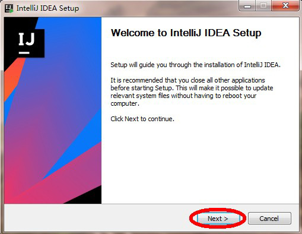

2. 选择安装路径

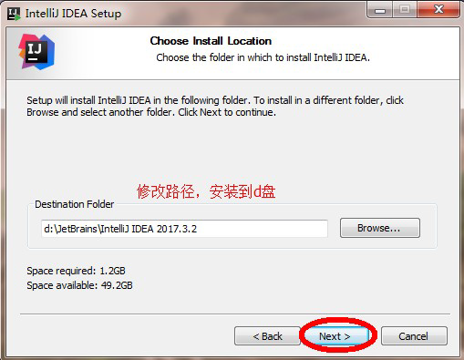

3. 配置安装选型

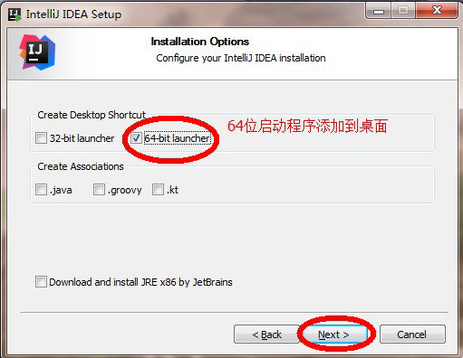

4. 开始菜单

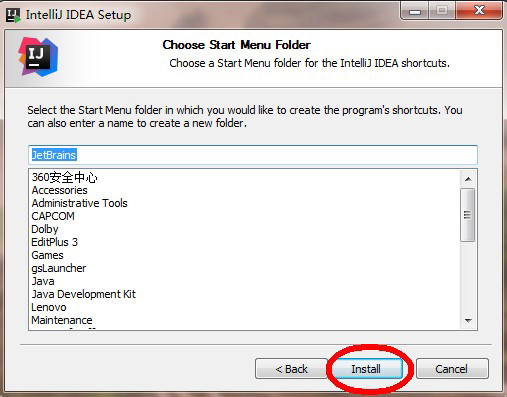

5. 安装完毕

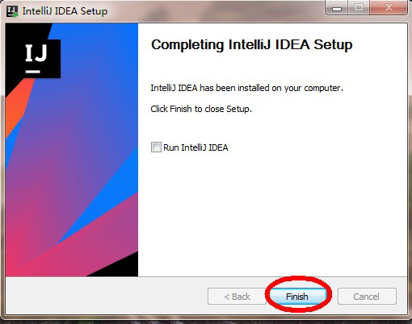

IDEA开发工具安装完成。

## 1.3 IDEA首次驱动

1. 选择不导入任何设置，点击`OK`

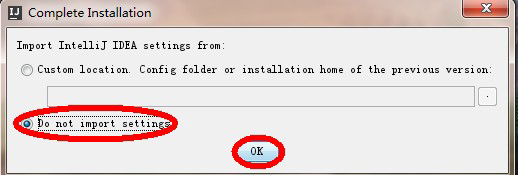

2. 选择 `Create New Project`

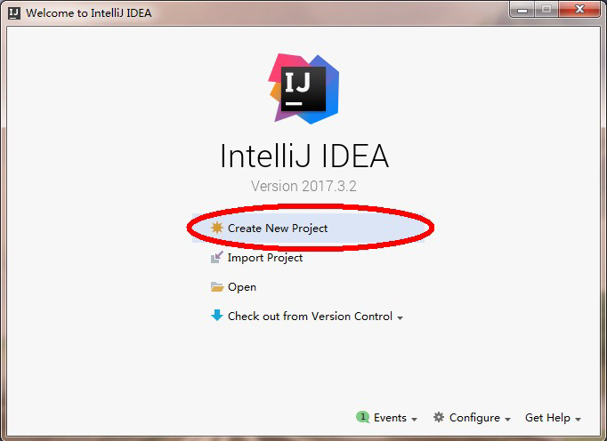

3. 点击`new` 按钮，配置安装的`JDK9` 版本

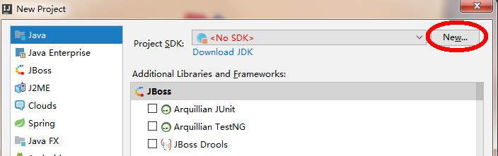

​		选择JDK9 目录，点击确定

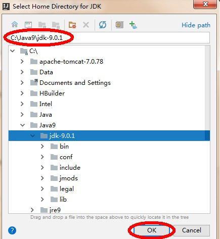

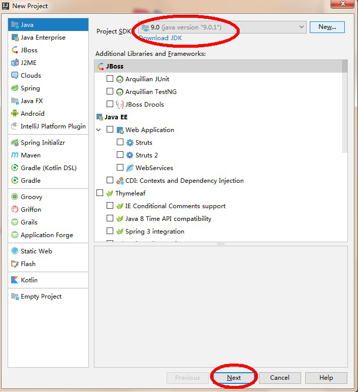

4. 不使用模板

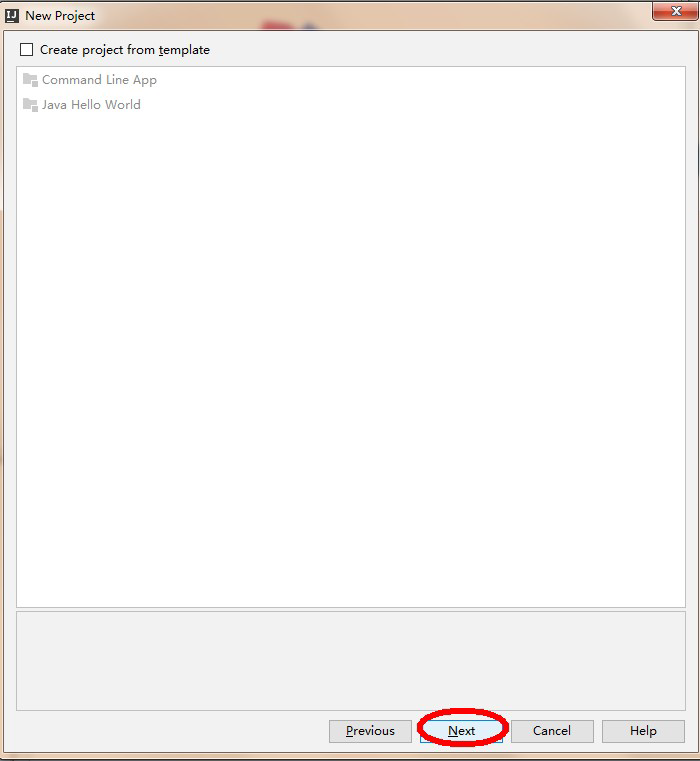

5. 为工程起名字`demo`，并存储到`d:\ideawork\demo`目录下，如果d盘没有这个目录，会自动创建。

> 首次新建项目时，默认的Project Location路径有问题，如 c:\\xxx ，正确写法为c:\xxx 。更改后不会再出现此类问题。


6. 打开一个每日一帖对话框，勾掉每次启动显示，点击`close`

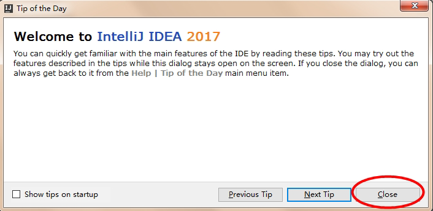

7. IEDA的工作界面，我们的项目已经创建好了。如果再新建项目，点击`File->new->Project`

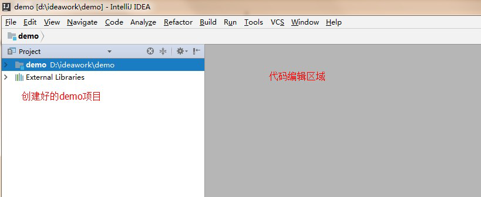

## 1.4 创建包和类

1. 展开创建的工程，在源代码目录`src`上，鼠标右键，选择`new->package`，键入包名`com.itheima.demo`，点击确定。

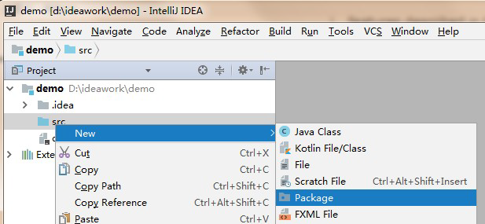

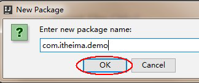

​		右键点击`com.itheima.demo` ，选择 `Show in Explorer` ，会发现创建包的目录结构。

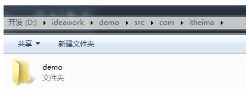

可见`com.itheima.demo`，表示创建了多级的文件夹。

> 小贴士： 所谓包，就是文件夹，用来对类文件进行管理。

2. 在创建好的包上，鼠标右键，选择`new->class`创建类，键入类名。

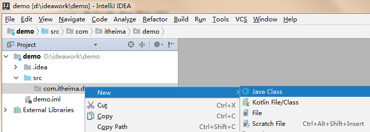

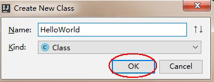

3. 在代码编辑区，键入主方法，并输入`HelloWorld`。

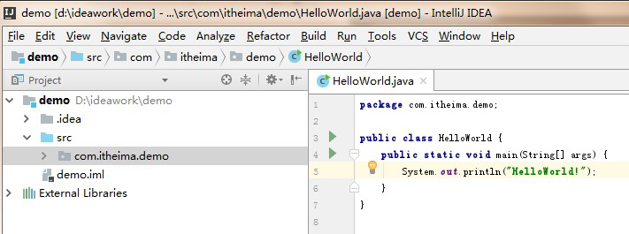

4. 运行程序，在代码编辑区鼠标右键，选择R`un HelloWorld` 即可，或在菜单中选择`Run->Run HelloWorld` 。

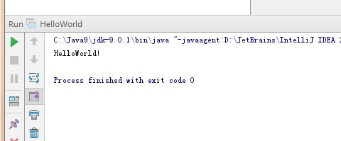

## 1.5 字体设置

DEA工具的默认字体非常小，代码编辑器和控制台的输出字体都需要进行调整。

- 点击菜单栏上的`File->Settings->Editor->Font` 修改字体。

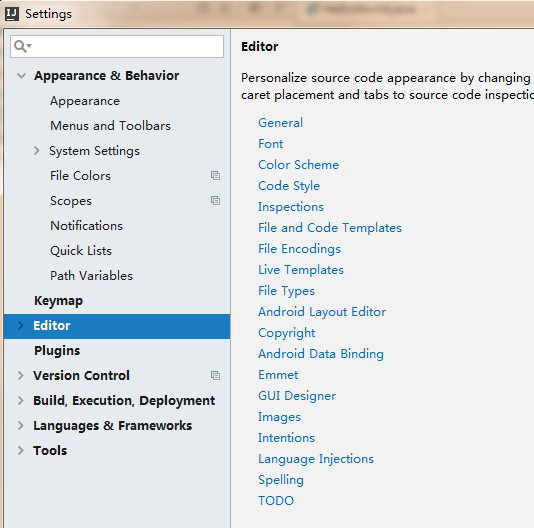

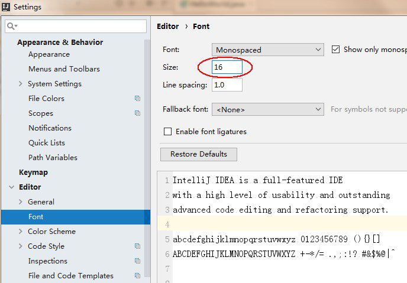

## 1.6 IDEA的项目目录

- 我们创建的项目，在d:\ideawork目录的demo下
  - `.idea` 目录和`demo.iml` 和我们开发无关，是IDEA工具自己使用的
  - `out` 目录是存储编译后的.class文件
  - `src` 目录是存储我们编写的.java源文件

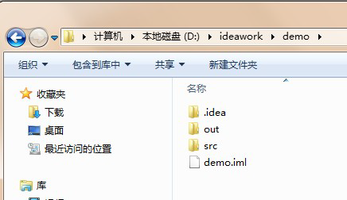

## 1.7 IDEA常用快捷键

| 快捷键               | 功能                                   |
| -------------------- | -------------------------------------- |
| `Alt+Enter`          | 导入包，自动修正代码                   |
| `Ctrl+Y`             | Ctrl+Y 删除光标所在行                  |
| `Ctrl+D`             | 复制光标所在行的内容，插入光标位置下面 |
| `Ctrl+Alt+L`         | 格式化代码                             |
| `Ctrl+/`             | 单行注释                               |
| `Ctrl+Shift+/`       | 选中代码注释，多行注释，再按取消注释   |
| `Alt+Ins`            | 自动生成代码，toString，get，set等方法 |
| `Alt+Shift+上下箭头` | 移动当前代码行                         |

## 1.8 IDEA修改快捷键

在IDEA工具中， `Ctrl+空格`的快捷键，可以帮助我们补全代码，但是这个快捷键和Windows中的输入法切换快捷键冲突，需要修改IDEA中的快捷键。

`File->Settings->keymap->Main menu->code->Completion->Basic`


双击`Basic->remove->Ctrl+空格`

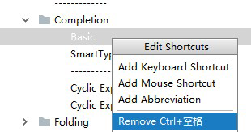

再次双击`Basic->Add Keyboard->键入 Alt+/->点击OK`

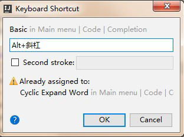

## 1.9 IDEA导入和关闭项目

关闭IDEA中已经存在的项目， `File->Close Project`

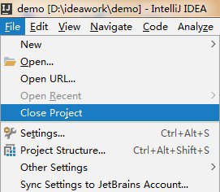

`File->Close Project` 这时IDEA回到了刚启动界面，点击项目上的`X` ，IDEA中就没有这个项目了

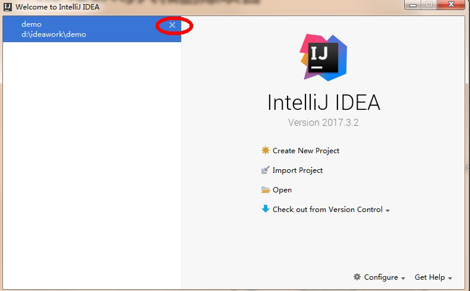

在IDEA的启动界面上，点击`OPEN` ，选择项目目录即可

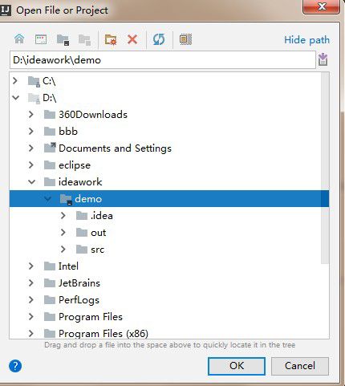

> 小贴士：
>
> 课后若想通过IDEA同时开启多个项目，点击OPEN打开项目时，点击New Window按钮

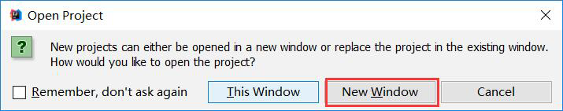


# 第二章 方法

## 2.1 回顾--方法的定义和调用

前面的课程中，使用过嵌套循环输出矩形，控制台打印出矩形就可以了，因此将方法定义为`void` ，没有返回值。在主方法`main` 中直接被调用。

```java
public class Method_Demo1() {
    public static void main(String[] args) {
        print();
    }
    
    private static void print() {
        for (int i = 0; i < 5; i++) {
            for (int j = 0; j < 8; j++) {
                System.out.print("*");
            }
            System.out.println();
        }
    }
}
```

`print` 方法被`main` 方法调用后直接输出结果，而`main` 方法并不需要`print` 方法的执行结果，所以被定义为`void` 。

## 2.2 定义方法的格式详解

```java
修饰符 返回值类型 方法名(参数列表){
    //代码省略...
    return 结果;
}
```

- 修饰符： `public static`固定写法
- 返回值类型： 表示方法运行的结果的数据类型，方法执行后将结果返回到调用者
- 参数列表：方法在运算过程中的未知数据，调用者调用方法时传递
- return： 将方法执行后的结果带给调用者，方法执行到`return` ，整体方法运行结束

> 小贴士：return **结果**; 这里的"结果"在开发中，我们正确的叫法成为**方法的返回值**

## 2.3 定义方法的两个明确

- **需求：** 定义方法实现两个整数的求和计算。
  - **明确返回值类型**： 方法计算的是整数的求和，结果也必然是个整数，返回值类型定义为`int`类型。
  - **明确参数列表：** 计算哪两个整数的和，并不清楚，但可以确定是整数，参数列表可以定义两个`int`类型的变量，由调用者调用方法时传递

```java
public class Method_Demo2 {
    public static void main(String[] args) {
        // 调用方法getSum，传递两个整数，这里传递的实际数据又称为实际参数
        // 并接收方法计算后的结果，返回值
        int sum = getSum(5, 6);
        System.out.println(sum);
        /*
        定义计算两个整数和的方法
        返回值类型，计算结果是int
        参数：不确定数据求和，定义int参数.参数又称为形式参数
		*/
        public static int getSum(int a, int b) {
            return a + b;
        }
    }
}
```

程序执行，主方法`main` 调用`getSum` 方法，传递了实际数据`5和6` ，两个变量`a和b` 接收到的就是实际参数，并
将计算后的结果返回，主方法`main` 中的变量`sum` 接收的就是方法的返回值。

## 2.4 调用方法的流程图解

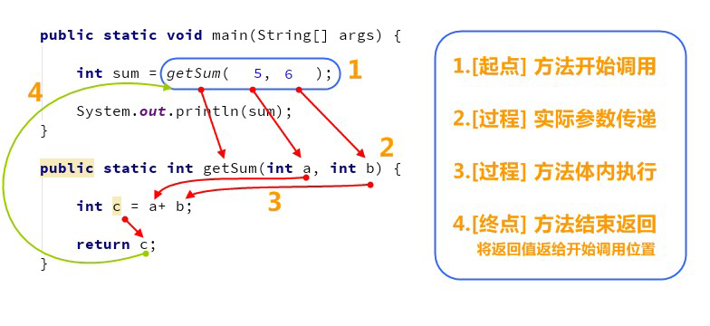

## 2.5 定义方法练习

### 练习一

**比较两个整数是否相同**

- 分析：定义方法实现功能，需要有两个明确，即`返回值` 和 `参数列表`。
  - **明确返回值：** 比较整数，比较的结果只有两种可能，相同或不同，因此结果是布尔类型，比较的结果相
    同为true，不同为false。
  - `明确参数列表：` 比较的两个整数不确定，所以默认定义两个`int`类型的参数。

```java
public class Method_Demo3 {
    public static void main(String[] args) {
        //调用方法compare，传递两个整数
        //并接收方法计算后的结果，布尔值
        boolean bool = compare(3, 8);
        System.out.println(bool);
    }
    
    /*
    	定义比较两个整数是否相同的方法
    	返回值类型，比较的结果布尔类型
    	参数：不确定参与比较的两个整数
    */
    public static boolean compare(int a, int b) {
        if (a == b) {
            return true;
        }else {
            return false;
        }
    }
}
```

### 练习二

**计算1+2+3...+100的和**

- 分析：定义方法实现功能，需要有两个明确，即`返回值`和`参数`。
  - **明确返回值：** 1~100的求和，计算后必然还是整数，返回值类型是`int`
  - **明确参数：** 需求中已知到计算的数据，没有未知的数据，不定义参数

```java
public class Method_demo4 {
    public static void main(String[] args) {
        //调用方法getSum
        //并接收方法计算后的结果，整数
        int sum = getSum();
        System.out.println(sum);
    }
    
    /*
        定义计算1~100的求和方法
        返回值类型，计算结果整数int
        参数：没有不确定数据
	*/
    public static void getSum() {
        //定义变量保存求和
        int sum = 0;
        //从1开始循环，到100结束
        for (i = 1; i <= 100; i++) {
            sum += i;
        }
        return sum;
    }
}
```

### 练习三

**实现不定次数打印**

- 分析：定义方法实现功能，需要有两个明确，即`返回值`和`参数`。
  - 明确返回值：方法中打印出`HelloWorld` 即可，没有计算结果，返回值类型`void` 。
  - 明确参数：打印几次不清楚，参数定义一个整型参数

```java
public class Method_demo5 {
    public static void main(String[] args) {
        //调用方法printHelloWorld，传递整数
        printHelloWorld(9);
    }
    
    /*
        定义打印HelloWorld方法
        返回值类型，计算没有结果 void
        参数：不确定打印几次
	*/
    public static void printHelloWorld(int n) {
        for (int i = 0; i < n; i++) {
            System.out.println("HelloWorld");
        }
    }
}
```

## 2.6 定义方法的注意事项

- 定义位置，类中方法外面。
- 返回值类型，必须要和`return` 语句返回的类型相同，否则编译失败 。

```java
// 返回值类型要求是int
public static int getSum() {
    return 5;// 正确，int类型
    return 1.2;// 错误，类型不匹配
    return true;// 错误，类型不匹配
}
```

- 不能在`return` 后面写代码， `return` 意味着方法结束，所有后面的代码永远不会执行，属于无效代码。

```java
public static int getSum(int a,int b) {
    return a + b;
    System.out.println("Hello");// 错误，return已经结束，这里不会执行，无效代码
}
```

## 2.7 调用方法的三种形式

- **直接调用：** 直接写方法名调用

```java
public static void main(String[] args) {
	print();
}
public static void print() {
	System.out.println("方法被调用");
}
```

- **赋值调用：** 调用方法，在方法前面定义变量，接收方法返回值

```java
public static void main(String[] args) {
    int sum = getSum(5,6);
    System.out.println(sum);
}
public static int getSum(int a,int b) {
	return a + b;
}
```

- **输出语句调用：**
  - 在输出语句中调用方法， `System.out.println(方法名())` 。

    ```java
    public static void main(String[] args) {
        System.out.println(getSum(5,6));
    }
    public static int getSum(int a,int b) {
        return a + b;
    }
    ```

  - 不能用输出语句调用`void` 类型的方法。因为方法执行后没有结果，也就打印不出任何内容。

    ```java
    public static void main(String[] args) {
        System.out.println(printHello());// 错误，不能输出语句调用void类型方法
    }
    public static void printHello() {
        System.out.println("Hello");
    }
    ```

## 2.8 方法重载

- **方法重载：** 指在同一个类中，允许存在一个以上的同名方法，只要它们的参数列表不同即可，与修饰符和返
  回值类型无关。
- 参数列表：个数不同，数据类型不同，顺序不同。
- 重载方法调用：JVM通过方法的参数列表，调用不同的方法。

## 2.9 方法重载练习

### 练习一

比较两个数据是否相等。参数类型分别为两个`byte` 类型，两个`short` 类型，两个`int` 类型，两个`long` 类型，并在`main` 方法中进行测试。

```java
public class Method_Demo6 {
    public static void main(String[] args) {
        //定义不同数据类型的变量
        byte a = 10;
        byte b = 20;
        short c = 10;
        short d = 20;
        int e = 10;
        int f = 10;
        long g = 10;
        long h = 20;
        // 调用
        System.out.println(compare(a, b));
        System.out.println(compare(c, d));
        System.out.println(compare(e, f));
        System.out.println(compare(g, h));
        }
    // 两个byte类型的
    public static boolean compare(byte a, byte b) {
        System.out.println("byte");
        return a == b;
    }
    // 两个short类型的
    public static boolean compare(short a, short b) {
        System.out.println("short");
        return a == b;
    }
    // 两个int类型的
    public static boolean compare(int a, int b) {
        System.out.println("int");
        return a == b;
    }
    // 两个long类型的
    public static boolean compare(long a, long b) {
        System.out.println("long");
        return a == b;
        }
}
```

### 练习二

判断哪些方法是重载关系。

```java
public static void open(){}  // 正确重载
public static void open(int a){}  //正确重载
static void open(int a,int b){}  //代码错误：和第8行代码冲突，有无public无关系，和参数名称无关系
public static void open(double a,int b){}  // 正确重载
public static void open(int a,double b){}  // 代码错误：和第6行代码冲突，有无static无关系
public void open(int i,double d){}  // 代码错误：和第5行代码冲突
public static void OPEN(){}  // 代码正确不会报错，但并不是有效重载，方法名称不同
public static void open(int i,int j){}  //代码错误：和第8行代码冲突
```

### 练习三

模拟输出语句中的`println` 方法效果，传递什么类型的数据就输出什么类型的数据，只允许定义一个方法名
`println`。

```java
public class Method_Demo7 {
    public static void println(byte a) {
    	System.out.println(a);
    }
    public static void println(short a) {
    	System.out.println(a);
    }
    public static void println(int a) {
    	System.out.println(a);
    }
    public static void println(long a) {
    	System.out.println(a);
    }
    public static void println(float a) {
    	System.out.println(a);
    }
    public static void println(double a) {
    	System.out.println(a);
    }
    public static void println(char a) {
    	System.out.println(a);
    }
    public static void println(boolean a) {
    	System.out.println(a);
        }
    public static void println(String a) {
    	System.out.println(a);
    }
}
```

