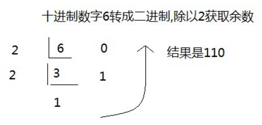
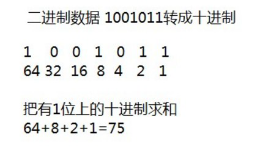
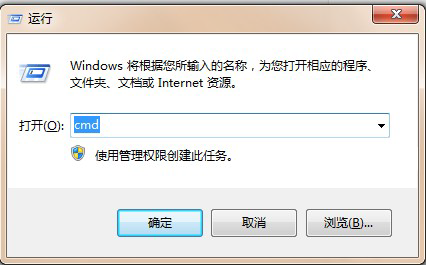
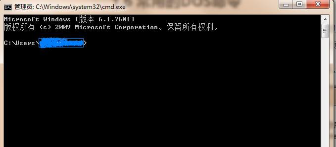
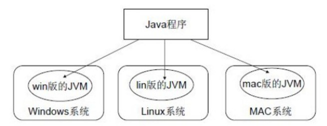

# 第一章 开发语言

## 1.1 Java语言概述

### 什么是Java语言
Java语言是美国Sun公司（Stanford University Network），在1995年推出的高级的编程语言。所谓编程语言，是
计算机的语言，人们可以使用编程语言对计算机下达命令，让计算机完成人们需要的功能。

### Java语言发展历史
* 1995年Sun公司发布Java1.0版本
* 1997年发布Java 1.1版本
* 1998年发布Java 1.2版本
* 2000年发布Java 1.3版本
* 2002年发布Java 1.4版本
* 2004年发布Java 1.5版本
* 2006年发布Java 1.6版本 
* 2009年Oracle甲骨文公司收购Sun公司，并于2011发布Java 1.7版本
* 2014年发布Java 1.8版本
* 2017年发布Java 9.0版本

### Java语言能做什么
Java语言主要应用在互联网程序的开发领域。常见的互联网程序比如天猫、京东、物流系统、网银系统等，以及服
务器后台处理大数据的存储、查询、数据挖掘等也有很多应用。

## 1.2 计算机基础知识

### 二进制
计算机中的数据不同于人们生活中的数据，人们生活采用十进制数，而计算机中全部采用二进制数表示，它只包含
0、1两个数，逢二进一，1+1=10。每一个0或者每一个1，叫做一个bit（比特）。
下面了解一下十进制和二进制数据之间的转换计算。

* **十进制数据转换成二进制数据:** 使用初一2获取余数的方式

  
* **二进制数据转换成十进制数据：** 使用8421编码的方式

  

> 小贴士:
> 二进制数系统中，每个0或1就是一个位，叫做bit(比特)。

### 字节
字节使我们常见的计算机中最小存储单元。计算机存储任何数据，都是以字节形式存储。右键点击文件属性，我们可以查看文件的字节大小。
8个bit（二进制位）0000-0000表示为1个字节，写成**1 byte**或者**1 B**。

* 8 bit   = 1 B
* 1024 B  = 1 KB
* 1024 KB = 1 MB
* 1024 MB = 1 GB
* 1024 GB = 1 TB

### 常用DOS命令

Java语言的初学者，学习一些Dos命令，会非常有帮助。DOS是一个早期的操作系统，现在已经被Windows系统取代，对于我们开发人员，目前需要在DOS中完成一些事情，因此就需要掌握一些必要的命令。

- 进入DOS操作窗口
  - 按下Windows+R键盘，打开运行窗口，输入cmd回车，进入到DOS的操作窗口。
	
  - 打开DOS命令行后，看到一个路径 c:\user 就表示我们现在操作的磁盘是c盘。
	

- 常用命令

	| 命令           | 操作符号      |
	| :------------- | ------------- |
	| 盘符切换命令盘 | `盘符名:`     |
	| 查看当前文件夹 | `dir`         |
	| 进入文件夹命令 | `cd 文件夹名` |
	| 退出文件夹命令 | `cd..`        |
	| 崔楚磁盘根目录 | `cd\`         |
	| 清屏           | `cls`         |


# 第二章 Java语言开发环境搭建


## 2.1 Java虚拟机——JVM

- **JVM**（Java Virtual Machine ）：Java虚拟机，简称JVM，是运行所有Java程序的假想计算机，是Java程序的
  运行环境，是Java 最具吸引力的特性之一。我们编写的Java代码，都运行在JVM 之上。

- **跨平台：**任何软件的运行，都必须要运行在操作系统之上，而我们用Java编写的软件可以运行在任何的操作系
  统上，这个特性称为**Java语言的跨平台特性。**该特性是由JVM实现的，我们编写的程序运行在JVM上，而JVM
  运行在操作系统上。



如图所示，Java的虚拟机本身不具备跨平台功能的，每个操作系统下都有不同版本的虚拟机。

## 2.2  JRE 和 JDK

- **JRE** (Java Runtime Environment) ：是Java程序的运行时环境，包含JVM 和运行时所需要的核心类库 。

- **JDK** (Java Development Kit)：是Java程序开发工具包，包含JRE 和开发人员使用的工具。

我们想要运行一个已有的Java程序，那么只需安装JRE 即可。

我们想要开发一个全新的Java程序，那么必须安装JDK 。


> 小贴士:
>
> 三者关系：JDK > JRE > JVM

## 2.3 JDK9安装图解

略

> 小贴士：
>
> 安装路径中，不要包含中文和空格。

## 2.4 JAVA_HOME环境变量的配置

### 配置环境变量作用

开发Java程序，需要使用JDK中提供的工具，工具在JDK9安装目录的bin 目录下。


在DOS命令行下使用这些工具，就要先进入到JDK的bin目录下，这个过程就会非常的麻烦。


不进入JDK的`bin` 目录，这些工具就不能使用，会报错。


为了开发方便，我们想**在任意的目录下都可以使用JDK的开发工具**，则必须要配置环境变量，配置环境变量的意义
在于告诉操作系统，我们使用的JDK开发工具在哪个目录下。

### 配置环境变量步骤

#### Windows 7,8版本

1. 计算机鼠标右键，选择`属性`

   

2. 选择`高级系统设置`

   

3. `高级`选项卡，点击`环境变量`

   

4. 点击`新建`，创建新的环境变量

   

5. 变量名输入`JAVA_HOME` ，变量值输入JDK9的安装目录 `c:\Java9\jdk-9.0.1`

   

6. 选中`Path` 环境变量， `双击`或者`点击编辑`

   

7. 在变量值的最前面，键入`%JAVA_HOME%\bin;` 分号必须要写，必须是英文格式。

   

8. 环境变量配置完成，重新开启DOS命令行，在任意目录下输入`javac` 命令，运行成功。

   

#### Windows 10 版本

1. 文件资源管理器 --> 此电脑鼠标右键 --> 选择`属性`

   

2. 选择`高级系统设置` --> 选择 `环境变量`

   

3. 点击下方系统变量的 `新建` ，创建新的环境变量，变量名输入`JAVA_HOME` ，变量值输入JDK9的安装目录

   `D:\02_DevelopTools\Java\jdk-9.0.1`

   

4. 选中`Path` 环境变量， `双击`或者`点击编辑`

   

5. 点击`新建`，键入`%JAVA_HOME%\bin` ，必须是英文格式。选中该行，上移到最上方，点击确定。

   

6. 环境变量配置完成，重新开启DOS命令行，在任意目录下输入`javac` 命令。

   

   

# 第三章 HelloWorld入门程序

## 3.1 程序开发步骤说明

开发环境已经搭建完毕，可以开发我们第一个Java程序了。
Java程序开发三步骤：**编写、编译、运行。**


## 3.2 编写Java源程序

1. 在`d:\day01` 目录下新建文本文件，完整的文件名修改为`HelloWorld.java`，其中文件名为`HelloWorld` ，后缀名必须为`.java` 。

2. 用记事本打开

   > 使用notepad++记事本软件。

3. 在文件中键入文本并保存，代码如下：

   ```java
   public class HelloWorld {
		public static void main(String[] args) {
			System.out.println("Hello World!");
		}
	}
   ```

   > 文件名必须是HelloWorld ，保证文件名和类的名字是一致的，注意大小写。
   >
   > 每个字母和符号必须与示例代码一模一样。

第一个`HelloWord` 源程序就编写完成了，但是这个文件是程序员编写的，JVM是看不懂的，也就不能运行，因此我们必须将编写好的`Java源文件` 编译成JVM可以看懂的`字节码文件` 。


# 第四章 常量

## 4.1 概述

**常量：是指在Java程序中固定不变的数据。**

## 4.2 分类

| 类型       | 分类                                     | 数据举例                    |
| ---------- | ---------------------------------------- | --------------------------- |
| 整数常量   | 所有的整数                               | 0，1， 567， -9             |
| 小数常量   | 所有的小数                               | 0.0， -0.1， 2.55           |
| 字符常量   | 单引号引起来，只能写一个字符，必须有内容 | 'A',  ' ',  '好'            |
| 字符串常量 | 双引号引起来，可以写多个字符，也可以不写 | "A",  "Hello",  "你好",  "" |
| 布尔常量   | 只能有个两个值(流程控制中讲解)           | true,  false                |
| 空常量     | 只有一个值(引用数据类型中讲解)           | null                        |

## 4.3 练习

需求： 输出各种类型的常量

```java
public class ConstantDemo {
	public static void main(String[] args){
		//输出整数常量
		System.out.println(123);
		//输出小数常量
		System.out.println(0.125);
		//输出字符常量
		System.out.println('A');
		//输出布尔常量
		System.out.println(true);
		//输出字符串常量
		System.out.println("你好Java");
	}
}
```


# 第五章 变量和数据类型

## 5.1 变量概述

- **变量：常量是固定不变的数据，那么在程序中可以变化的量称为变量。**

> 数学中，可以使用字母代替数字运算,例如 x=1+5 或者 6=x+5。
>
> 程序中，可以使用字母保存数字的方式进行运算，提高计算能力，可以解决更多的问题。比如x保存5，x也可
> 以保存6，这样x保存的数据是可以改变的，也就是我们所讲解的变量。

Java中要求一个变量每次只能保存一个数据，必须要明确保存的数据类型。

## 5.2 数据类型

### 数据类型分类

Java的数据类型分为两大类：

- **基本数据类型：** 包括`整数`、`浮点数`、`字符`、`布尔`。
- **引用数据类型：**包括`类`、`数组`、`接口`。

### 基本数据类型

四类八种基本数据类型：

| 数据类型     | 关键字         | 内存占用 | 取值范围               |
| ------------ | -------------- | -------- | ---------------------- |
| 字节型       | byte           | 1个字节  | -128~127               |
| 短整型       | short          | 2个字节  | -32768~32767           |
| 整形         | int（默认）    | 4个字节  | -2的31次方~2的31次方-1 |
| 长整形       | long           | 8个字节  | -2的63次方~2的63次方-1 |
| 单精度浮点数 | float          | 4个字节  | 1.4013E-45~3.4028E+38  |
| 双精度浮点数 | double（默认） | 8个字节  | 4.9E-324~1.7977E+308   |
| 字符型       | char           | 2个字节  | 0~65535                |
| 布尔类型     | boolean        | 1个字节  | true, false            |

> Java中的默认类型：整数类型是int 、浮点类型是double 。

## 5.3 变量的定义

变量定义的格式包括三个要素： `数据类型` 、 `变量名` 、 `数据值` 。

#### 格式

```
数据类型 变量名 = 数据值;
```

****

#### 练习

定义所有基本数据类型的变量，代码如下：

```java
public class Variable {
	public static void main(String[] args){
        //定义字节型变量
        byte b = 100;
        System.out.println(b);
        //定义短整型变量
        short s = 1000;
        System.out.println(s);
        //定义整型变量
        int i = 123456;
        System.out.println(i);
        //定义长整型变量
        long l = 12345678900L;
        System.out.println(l);
        //定义单精度浮点型变量
        float f = 5.5F;
        System.out.println(f);
        //定义双精度浮点型变量
        double d = 8.5;
        System.out.println(d);
        //定义布尔型变量
        boolean bool = false;
        System.out.println(bool);
        //定义字符型变量
        char c = 'A';
        System.out.println(c);
    }
}
```

> long类型：建议数据后加L表示。
>
> float类型：建议数据后加F表示。


## 5.4 注意事项

- 变量名称：在同一个大括号范围内，变量的名字不可以相同。
- 变量赋值：定义的变量，不赋值不能使用。